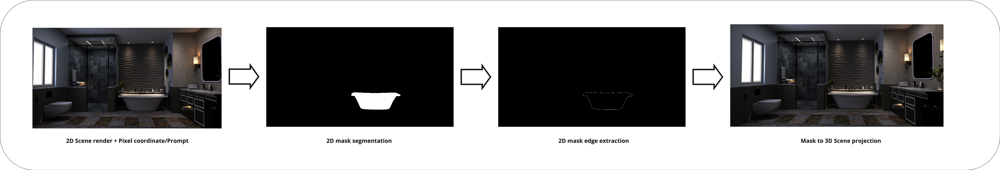

# Segment anything in a 3D scene

The idea behind this demo is to combine Meta's [Segment Anything Model (SAM)](https://github.com/facebookresearch/segment-anything) and [BLIP/BLIP2](https://huggingface.co/docs/transformers/main/model_doc/blip-2) to identify and segment arbitratry volumes (regardless of underlying mesh composition) in a 3D scene. The demo is built using [THREE.js](https://threejs.org/) for rendering of the scene.

## How it works

- 2D pixel coordinates (currently from pointer) are sent to the processing API along with a 2D render of the scene
- SAM creates masks of the pointed object
- BLIP identifies the object ⚒️ WORK IN PROGRESS ⚒️
- Optimisation (edge extraction) is applied to the mask to reduce the amount of points to be rendered
- 2D mask projected back into 3D space and rendered as a bounding box

Basically 2D to 3D space conversions, nothing fancy.

## Project structure
- `./notebooks` was my initial prototyping of the image segmentation and contains the logic what was eventually ported into a processing API for demo purposes
- `./demo` contains the demo code for the web viewer which uses a modified [three-gltf-viewer](https://github.com/donmccurdy/three-gltf-viewer) (for great scene defaults and ease of swapping 3D scenes) + processing api
  * `./demo/lib/api` contains the processing API (segmentation + identification of volumes + optimisation like edge extraction)
  * `./demo/lib/three` contains the adapters used in THREE for 2D to 3D projection and vice versa

## Installation / Run the demo

## Dependencies (and many thanks to)
- [THREE.js](https://threejs.org/) for rendering of scene
- [three-gltf-viewer](https://github.com/donmccurdy/three-gltf-viewer) fork for demo scene loading and playground
- [Segment Anything Model (SAM)](https://github.com/facebookresearch/segment-anything) for segmentation of scene renders
- [BLIP/BLIP2](https://huggingface.co/docs/transformers/main/model_doc/blip-2) for identification/captioning of volumes in the scene

## TODO's
- [ ] Use BLIP for image identification/captioning
- [ ] Send smaller renders to the processing API, convert them back post processing
- [ ] Generate a 3D grid from multiple 2D maskes produced by SAM and use that for projection
- [ ] Use BVH for accrued raycasting performance

## Caveats
- Slow on CPU (most of the time is spent on segmentation/identification)
- The bounding box is not always accurate (especially when the camera is not facing the object directly)
  * To improve accuracy, you would need to take multiple renders of the scene from different angles and then combine the masks to get a more accurate bounding box

